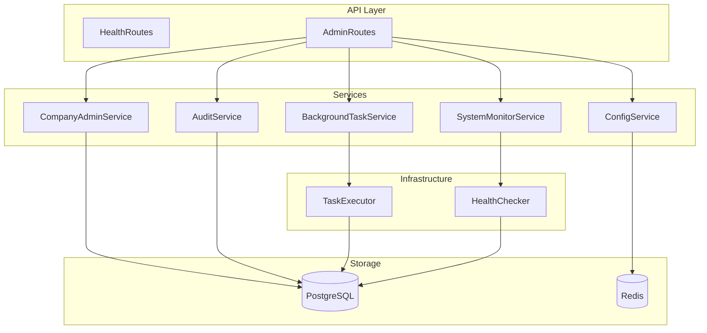

> Тег: `АКТУАЛЬНО` | Обновлён: `2026-03-01` | Версия: `1.0`

# Admin Service — Архитектура

## Компоненты



## ZIO Layer Graph

```
Main
├── AppConfig.live
├── TransactorLayer.live
├── Redis.local
├── CompanyAdminService.live
│   └── Transactor
├── SystemMonitorService.live
│   └── HealthChecker.live
├── ConfigService.live
│   └── Redis
├── AuditService.live
│   └── Transactor
├── BackgroundTaskService.live
│   └── TaskExecutor.live
└── Server.defaultWithPort(8097)
```
