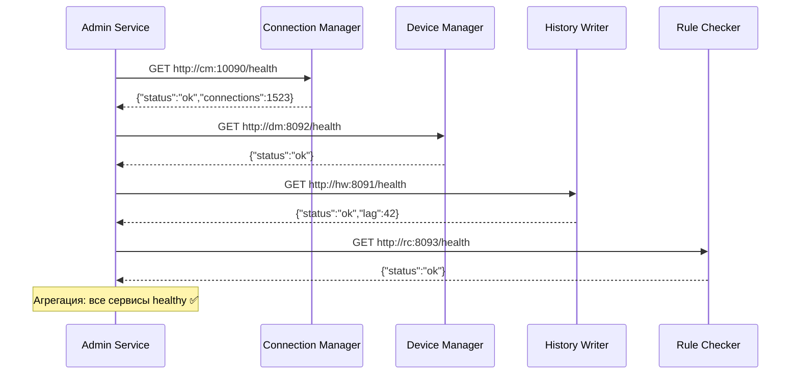

> Тег: `АКТУАЛЬНО` | Обновлён: `2026-03-02` | Версия: `1.0`

# 📖 Изучение Admin Service

> Руководство по Admin Service — сервису системного администрирования.

---

## 1. Назначение

**Admin Service (ADS)** — суперадминская панель для управления всей системой:
- Управление компаниями (создание, блокировка, лимиты)
- Мониторинг здоровья всех сервисов (health checks)
- Feature flags и системная конфигурация
- Фоновые задачи (cleanup, backup)
- Аудит действий администраторов
- Статистика использования (кол-во устройств, точек, нагрузка)

**Порт:** 8097. Не использует Kafka.

---

## 2. Архитектура

```
AdminRoutes → CompanyAdminService → PostgreSQL (все компании)
           → SystemMonitorService → HTTP health checks к другим сервисам
           → ConfigService (Ref) → feature flags, system config
           → AdminAuditService → PostgreSQL (audit log)
           → BackgroundTaskService → cleanup, backup задачи
           → StatsService → PostgreSQL (агрегации)
```

### Компоненты

| Файл | Назначение |
|------|-----------|
| `service/CompanyAdminService.scala` | CRUD компаний, лимиты, блокировка |
| `service/SystemMonitorService.scala` | Health check всех сервисов |
| `service/ConfigService.scala` | Feature flags (Ref in-memory) |
| `service/AdminAuditService.scala` | Журнал действий |
| `service/BackgroundTaskService.scala` | Фоновые задачи (cleanup, backup) |
| `service/StatsService.scala` | Статистика системы |
| `api/AdminRoutes.scala` | REST endpoints |

---

## 3. API endpoints

```bash
# Компании
GET    /admin/companies                 # Список всех компаний
GET    /admin/companies/{id}            # Детали компании  
POST   /admin/companies/{id}/block      # Заблокировать
POST   /admin/companies/{id}/unblock    
PUT    /admin/companies/{id}/limits     # Изменить лимиты

# Мониторинг
GET    /admin/health                    # Здоровье всех сервисов
GET    /admin/metrics                   # Системные метрики

# Конфигурация
GET    /admin/config                    # Текущие feature flags
PUT    /admin/config/{key}              # Изменить флаг
GET    /admin/config/maintenance       # Режим обслуживания

# Аудит
GET    /admin/audit?from=...&to=...    # Журнал действий

# Фоновые задачи
POST   /admin/tasks/cleanup            # Запустить очистку
POST   /admin/tasks/backup             # Запустить backup
GET    /admin/tasks                    # Статус задач

# Статистика
GET    /admin/stats/overview           # Общая сводка системы
GET    /admin/stats/usage              # Использование по компаниям
```

---

## 4. SystemMonitorService — как работает



---

## 5. Типичные ошибки

| Проблема | Причина | Решение |
|----------|---------|---------|
| Health показывает DOWN для сервиса | Сервис не запущен / порт неверный | Проверить docker-compose, порты |
| Feature flag не применяется | ConfigService в Ref (только в этом инстансе) | Рестартовать или перевести на Redis |
| Аудит не пишется | TransactorLayer / PostgreSQL проблема | Проверить подключение к БД |

---

*Версия: 1.0 | Обновлён: 2 марта 2026*
